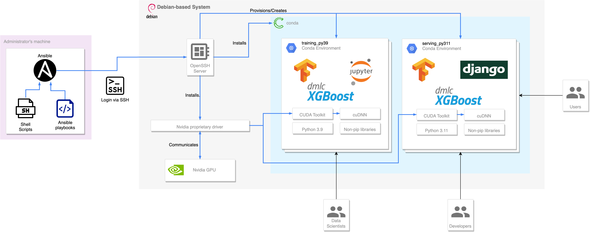

# Project Architecture

The following diagram serves as an example and a high-level overview on the project's architecture,
as well as the communication paths between different components:

For illustrating conda's ability to manage multiple environments, in the above example **2** separate python environments were created, each installed with their own dependencies according to their needs.

For example, Jupyter Notebook/Lab server is installed in the training environment for data scientists to conduct EDA, model training & evaluation activities.

On the other hand, the deployment does not require such library thus it is not installed. Instead, web services libraries such as Django is installed for creating services to provide access to developers for service development and to end users for consumption.  